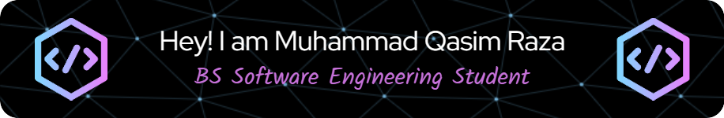

## About Me:

I'm Muhammad Qasim Raza. I am a talented, ambitious, and hardworking individual. As a student, I'm doing Bs Software Engineering from Sindh Madrasa-tul-Islam University, City Campus, Karachi. It's my third year at University (6th Semester).  

I have successfully completed the MERN Stack Development program at "Bano Qabil Institute" and have received a well-deserved certificate. During the course, I acquired valuable skills in developing full-stack web applications, gaining proficiency in MongoDB, ExpressJS, ReactJS, and NodeJS, which are essential tools and technologies in this field.

## Education:

BS Software Engineering, Sindh Madrasa-tul-Islam University City Campus Karachi, "6th Semester"
(2021-2025).  

Intermediate in Pre-Engineering, Islamia Government Science College Karachi
(2018-2020).  

Matric in Science, Haji Akber School Karachi
(2016-2018).

<h3 align="center">I am constantly seeking to learn more about the latest developments in the tech industry.</h3>

## Skills:

 
        <a>
            HTML5,
            CSS3,
            Bootstrap,
            JavaScript,
            React,
            Node.js,
            Express.js,
            MongoDB,    
            Programming,
            Microsoft Office,
            Self-confidence,
            Communication Skills,
            Problem Solving,
            Hard working,
            Leadership,
            Creativity,
            Adaptability
        </a>

### Visit My Linkedin Profile:   https://www.linkedin.com/in/muhammad-qasim-raza-se/  

### Check My Resume:   https://drive.google.com/file/d/1Sl_Xu9_sZYYJTPnDFpCbt25-XnyDu9Z7/view

## Check My Github Stats:

## Mostly Used top languages:

## Connect with me:

